- **[Ukrainian version](README.md)**
- **[English version](docs/README_ENG.md)**

# *cloudos_orchestra* - це рішення-оркестратор для автоматизованого розгортання і конфігурації серверів для DDOS на базі Cloud провайдерів [AWS, GCP, AZURE, DigitalOcean, Oracle]. Використовується разом з mhddos_proxy або db1000n + за бажанням VPN (ExpressVPN)

### Відеоогляд:

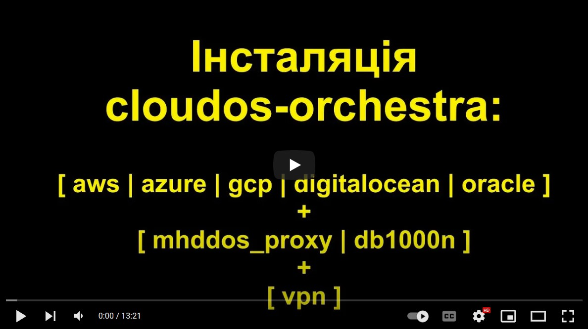
[](https://www.youtube.com/watch?v=OLNZicyHHXo "Cloudos")

### Основні можливості на даний момент:

1. Автоматизація створена за допомогою відомої Infrastructure as Code тули - [terraform](https://www.terraform.io/).


2. Код автоматизує розгортання мінімально необхідної інфраструктури та серверів для таких клауд провайдерів як:
   - AWS
   - GCP
   - Azure
   - DigitalOcean (DO)
   - Oracle


3. Можливі DDOS утиліти для використання (використовуються в скрипті `cloudos_server.sh)`:
- [mhddos_proxy](https://github.com/porthole-ascend-cinnamon/mhddos_proxy)
- [db1000n](https://github.com/Arriven/db1000n)

4. Інтегрована можливість використання VPN, а саме [ExpressVPN](expressvpn.com). 

5. Адаптовано для використанная на:
- Linux Ubuntu 20.04
- macOS
- Windows (Ubuntu on WSL https://docs.microsoft.com/en-us/windows/wsl/install)

### Основні принципи цього рішення:
- Безпечність. На серверах є можливість автоматично встановлювати та вмикати VPN від ExpressVPN. Також передбачена можливість користуватися proxy в залежності від DDOS утиліти (наприклад така можливість є в mhddos_proxy). Це все ускладнить процес деанонімізації.

- Безкоштовність. Кожен із клаудів дає можливість безкоштовно використовувати ресурси протягом певного терміну. Але в межах дозволеного ліміту!!! Будьте з цим уважні та моніторте використані ресурси.
  
  *В разі використання ExpressVPN - підписка на VPN коштуватиме близько 12 доларів на місяць.

- Масштабування. Можливість вказувати кількість серверів які необхідно створити для кожного із клаудів (рекомендуємо не більше 5-ти).

- Відмінна документація, яка наглядно описує етапи створення і налаштування 5-ти різних видів клаудів.

Як користуватися cloudos-orchestra:
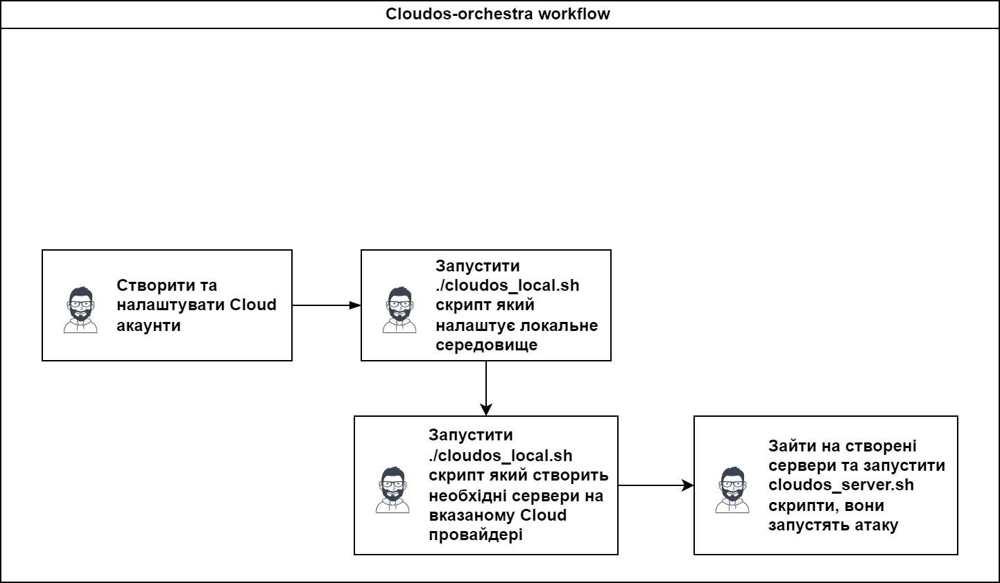

Схема як працює cloudos разом з VPN:
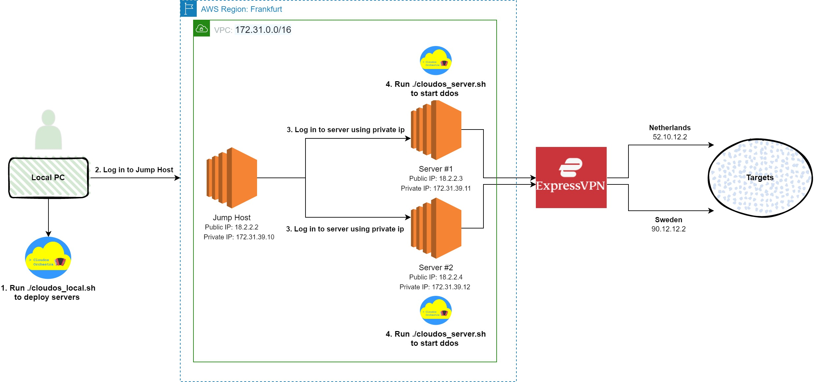

Схема як працює cloudos без VPN:
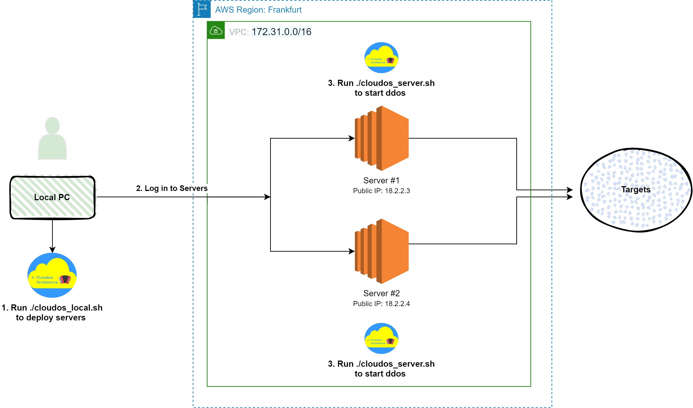

---

## Інсталяція та налаштування

- **[Відеоінструкція на youtube](https://www.youtube.com/watch?v=OLNZicyHHXo)**
 
## 1. Підготовчі кроки

### 1.1 Створити ExpressVPN акаунт
<details>
  <summary>Деталі:</summary>

1.1.1 Щоб зареєструвати новий ExpressVPN акаунт, йдемо на сайт ExpressVPN: 
https://www.expressvpn.com

вибираємо  GetExpressVPN

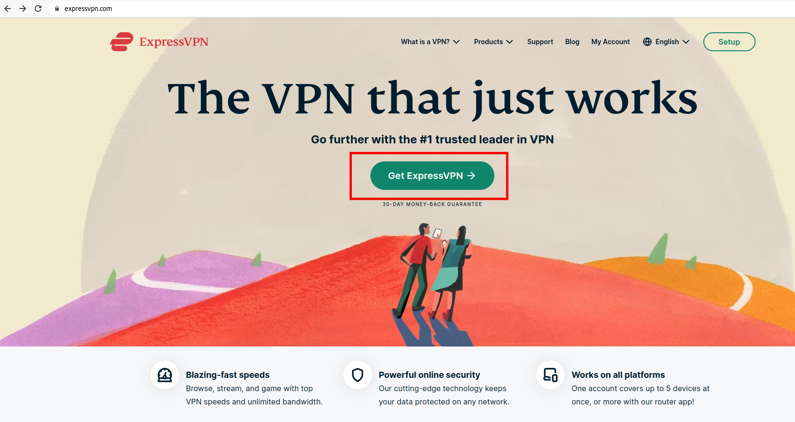


Вказуємо тип оплати, email для реєстрації,та дані для оплати карткою, PayPal або Bitcoin:

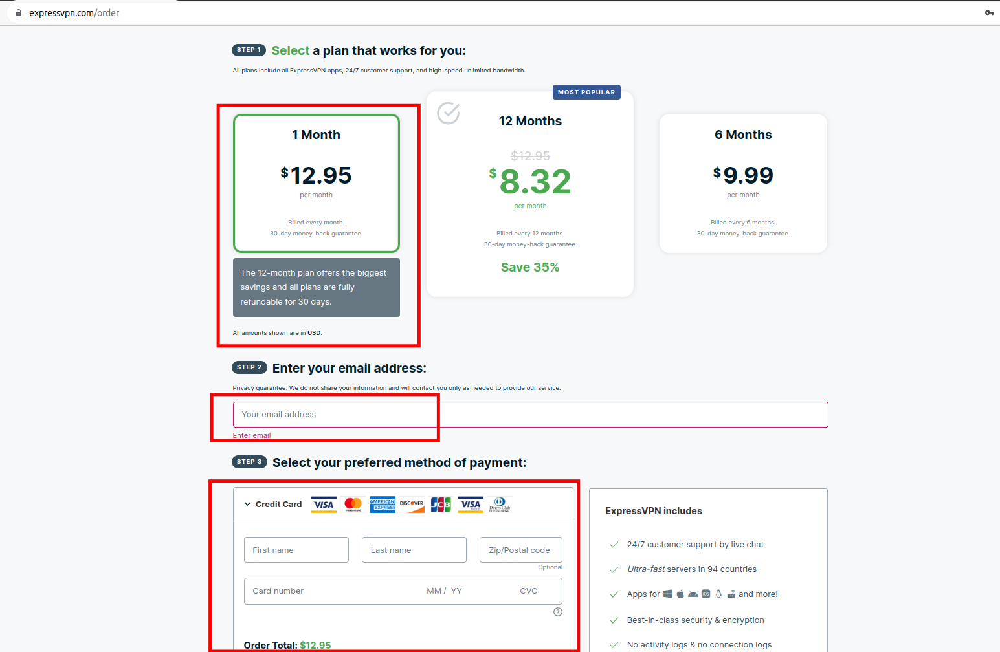

Зареєструвавшись, у нас з'явиться Activation Code, який будемо використовувати для активації ВПН для наших серверів:

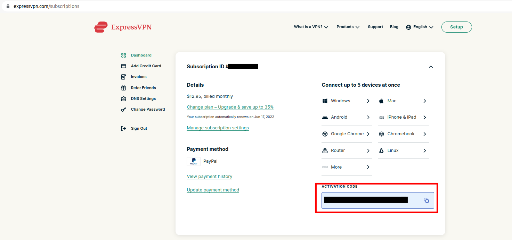


</details>

### 1.2 Конфігуруємо локальне оточення
<details>
  <summary>Налаштувати автоматично за допомогою скрипта cloudos_local.sh:</summary>

В локальному терміналі (звідки повинні будуть запускатися terraform команди) запускаємо скрипт:
```
# cd files/
# ./cloudos_local.sh
```
Вибираємо пункт №1

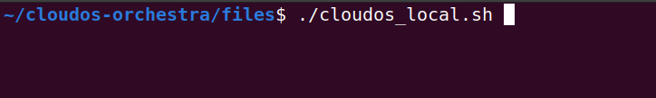

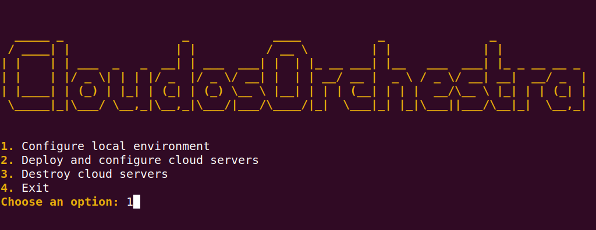


</details>


<details>
  <summary>Налаштувати вручну без допомоги скрипта:</summary>

### 1.2.1 Загружаємо гіт репозиторій
```
# git clone git@github.com:ops-orchestra/cloudos-orchestra.git
```

### 1.2.2 Створюємо ssh ключ за допомогою якого зможемо заходити на сервери 
```
# ssh-keygen -f ~/.ssh/cloud-ssh
```

### 1.2.3 Встановлюємо terraform
```
# ssh-keygen -f ~/.ssh/cloud-ssh -P ""
# sudo apt install unzip -y
# wget https://releases.hashicorp.com/terraform/1.1.9/terraform_1.1.9_linux_amd64.zip
# unzip terraform_1.1.9_linux_amd64.zip
# chmod  +x terraform
# sudo mv terraform /usr/bin/
# terraform -v
# rm terraform_1.1.9_linux_amd64.zip
```

### 1.3 Зберігаємо код активації (Activation code) від ExpressVPN

1.3.1 Логуємося в створений обліковий запис в https://www.expressvpn.com/setup, 

там знаходим  **Activation Code**, копіюємо його.  

Відкриваємо текстовим редактором файл `files/expressvpn_activation_code`,
замінюємо `CHANGE_ME` на код активації **Activation code**.

</details>

## 2. Зареєструвати Cloud акаунт:
- [AWS](https://www.youtube.com/watch?v=0lAqireJu5s)
- [Azure](https://www.youtube.com/watch?v=1IlOUFlDPfw)
- [GCP](https://www.youtube.com/watch?v=1cmv3P6nL7M)
- [DigitalOcean](https://www.youtube.com/watch?v=olzT5bLizvI)
- [Oracle (in progress)](youtube.com/README_Oracle.md)

## 3. Налаштувати Cloud акаунт:
- [AWS](docs/README_AWS.md)
- [Azure](docs/README_AZURE.md)
- [GCP](docs/README_GCP.md)
- [DigitalOcean](docs/README_DO.md)
- [Oracle (in progress)](docs/README_Oracle.md)


## 4. Створення серверів та необхідної хмарної інфраструктури
<details>
  <summary>4.1 a) Налаштувати автоматично за допомогою скрипта cloudos_local.sh:</summary>


Запускаємо скрипт:
```
# cd files/
# ./cloudos_local.sh
```
Вибираємо пункт №2

Далі вибираємо:
- тип Cloud провайдера в якому будуть створені сервери 
- кількість серверів які потрібно створити
- чи запускати mhddos_proxy в режимі autostart. Цей спосіб є максимально автоматизованим, але є і найбільш ризикованим і не працює з ExpressVPN. 
- чи потрібно встановлювати інфраструктуру для ExpressVPN (для цього буде створено додатковий jump host, через який потрібно заходити на кінцеві сервери)


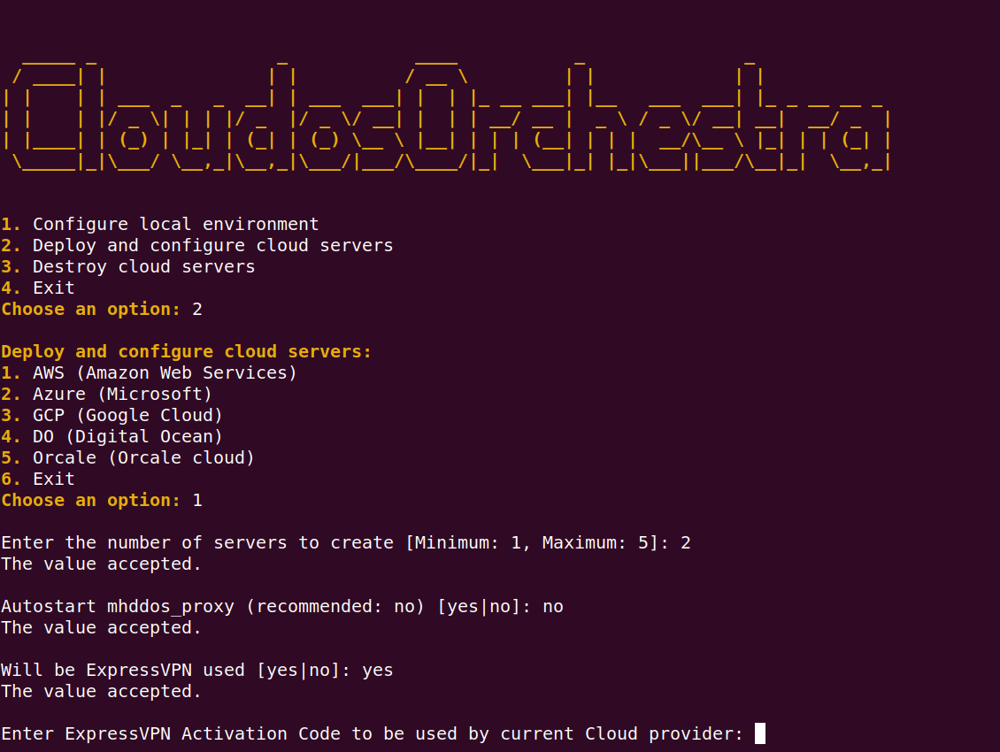


</details>


<details>
  <summary>4.1 b) Налаштувати вручну без допомоги скрипта (приклад як розгорнути AWS Cloud):</summary>

Відредагуємо `terraform/aws/locals.tf`. 

Тут можемо вказати необхідну кількість серверів, регіон де їх створювати, розмір інстансів, чи потрібно буде використовувати ExpressVPN та інше.

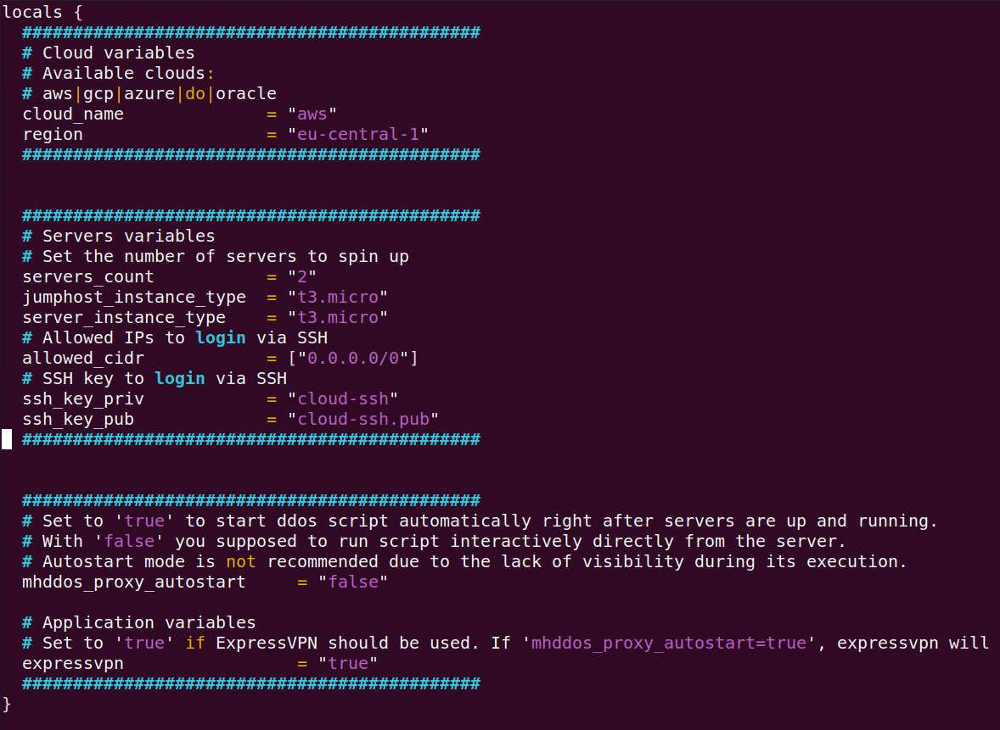

Якщо використовуємо ExpressVPN, то необхідно відредагувати`files/expressvpn_activation_code`, вказуємо актуальний Activation Code від ExpressVPN

Створюємо наші сервери за допомогою terraform:
```
# cd terraform/aws
# terraform init
# terraform apply
```
Повторюємо, за зразком, для інших Cloud провайдерів (вони знаходяться в директорії terraform/***).

</details>

<details>
  <summary>4.2 Після розгортання серверів та інфраструктури, логуємося на створені сервери й запускаємо атаку:</summary>

- під час попереднього кроку були створені файли, які можно використовувати для зручності при логуванні на сервери:
  - files/CLOUD/commands.txt
  - files/CLOUD/servers.txt
- якщо ExpressVPN опція була включена, то на сервери потрібно заходити через jump host сервер (використовуючи приватний IP кінцевого сервера)
- зайшовши на сервер:
  - перевіряємо, що наші цілі актуальні:
      cat ~/targets.txt
  - запускаємо скрипт <i>./cloudos_server.sh</i>, вибираємо утиліту для запуску DDOS та інші параметри які буде запитувати скрипт:

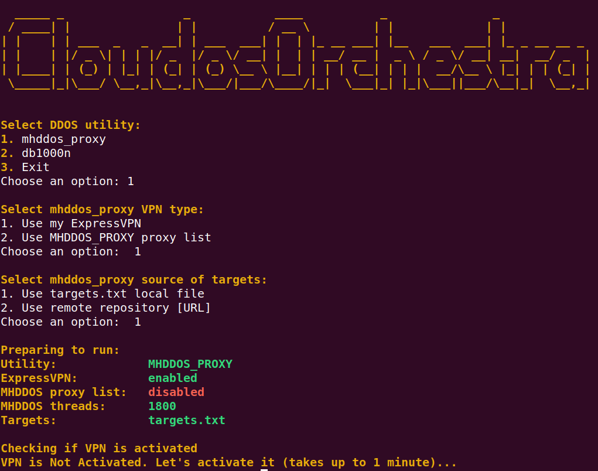

</details>   


## 5. Видалення створених ресурсів

В час відсутності активності, або щоб зберегти кошти, ми можемо швидко видалити створені ресурси.

<details>
  <summary>Видалити, якщо ресурси створювалися за допомогою скрипта cloudos_local.sh:</summary>

Запускаємо скрипт:

```
# cd files/
# ./cloudos_local.sh
```
Вибираємо пункт №3: Destroy cloud servers і тип клауду, ресурси в якому потрібно видалити.

</details>

<details>
  <summary>Видалити, якщо ресурси створювалися без допомоги скрипта:</summary>

```
# cd terraform/CLOUD
# terraform destroy
```
</details>

---

## Інше

### Файли:
- <b>cloudos_local.sh</b> - скрипт за допомогою якого можно налаштувати локальне середовище (інсталяція тераформу, генерація ssh ключів). Також цей скрипт використовується для розгортання/видалення серверів/ресурсів для таких клаудів як AWS, Azure, GCP, DO, Orcale.
- <b>cloudos_server.sh</b> - terraform переносить цей скрипт на створений сервер. Ми логуємося на сервер, запускаємо цей скрипт і запускаємо атаку.
- <b>expressvpn.sh</b> - цей скрипт викликається при виконанні cloudos_server.sh, необхідний для автоматичного підтвердження інтерактивного діалогу при інсталяції ExpressVPN. 
- <b>userdata.sh</b> - terraform запускає цей скрипт для інсталяції та налаштування необхідних утиліт на сервері.
- <b>expressvpn_activation_code</b> - файл повинен зберігати ExpressVPN Activation ключ. Якщо використовується cloudos_local.sh, то скрипт автоматично добавляє ключ в цей файл. Якщо скрипт не використовується, то файл необхідно відредагувати власноруч.
- <b>targets.txt</b> - файл в якому зберігається список цілей для Ддос атак. Тераформ відправляє його на сервер. Далі його може використовувати, наприклад, mhddos_proxy. Файл необхідно редагувати та вказувати актуальні цілі. Формат файлу повинен бути саме таким яким є оригінал в репозиторію (без ком, без лишніх символів).

### Лінки проекту:

Youtube:
https://www.youtube.com/channel/UC9uaW0rtPumDdzVhfyVprJg

Telegram:
Cloudos Orchestra - Chat
https://t.me/cloudosorchestrachat

Cloudos Orchestra
https://t.me/cloudosorchestra

