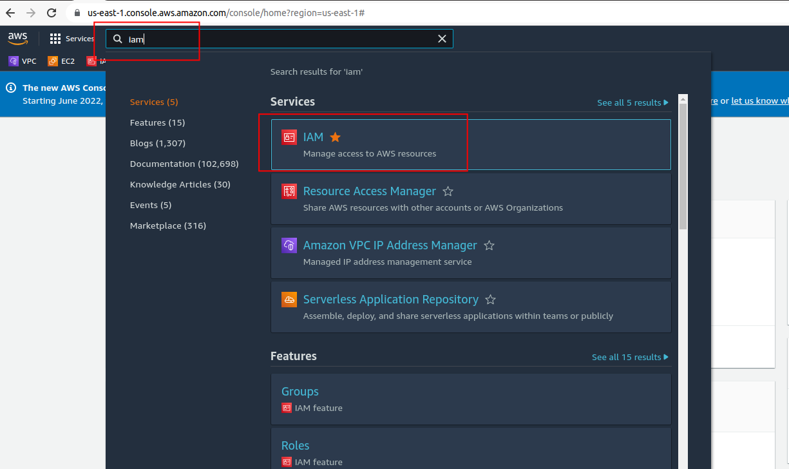
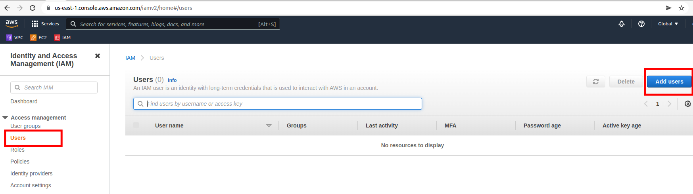
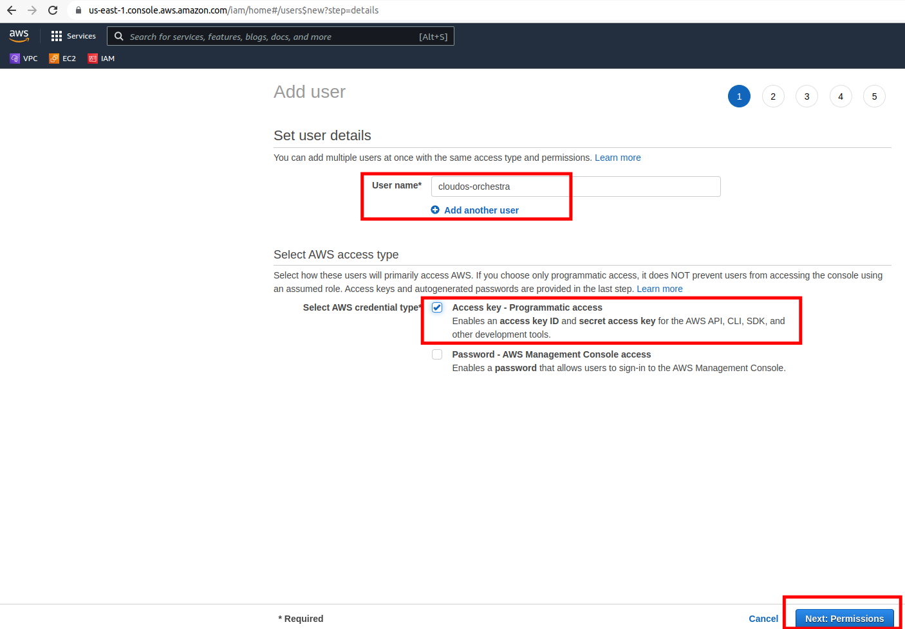
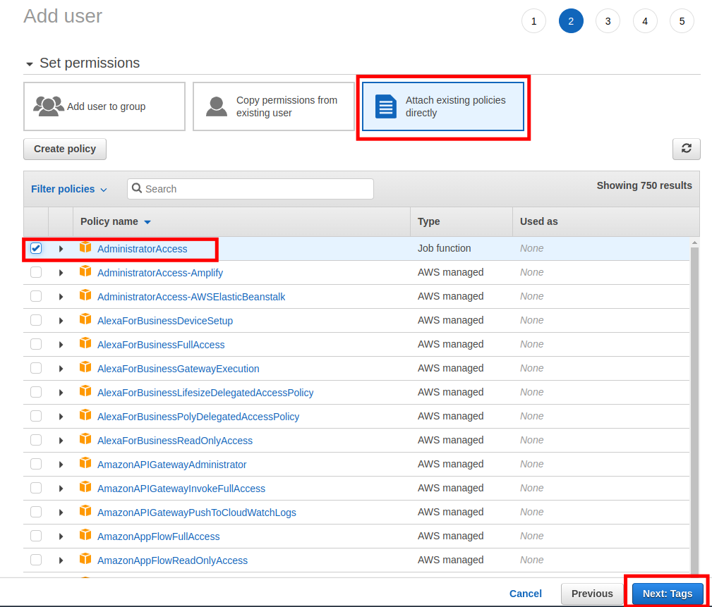
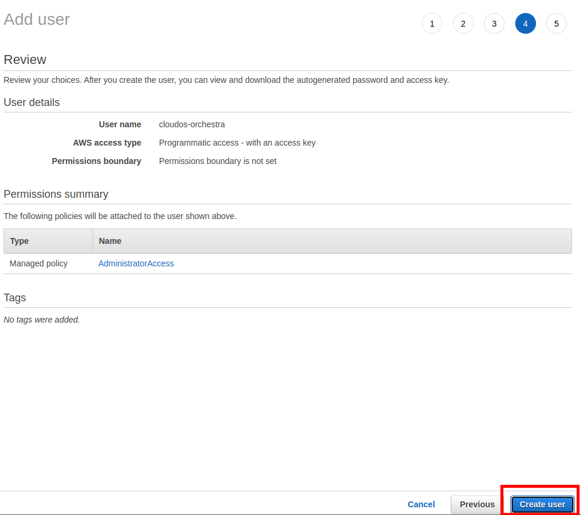
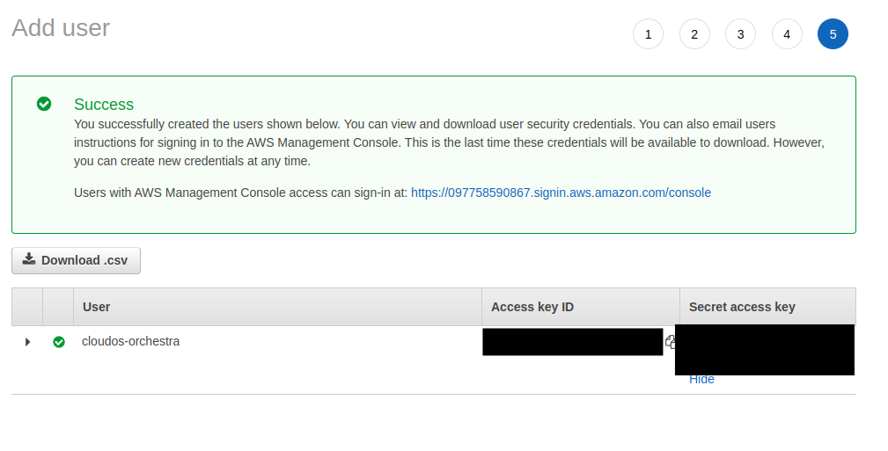

3.1 Логуємося до AWS Console:
- створюємо AWS IAM користувача з Administrator політикою
- зберігаємо його Access та Secret ключі

1.


---
2.


---
3.


---
4.


---
5.


---
6.


---


3.2 Відредагуємо `terraform/aws/providers.tf`, де вказуємо <i>access_key</i> та <i>secret_key</i> свого AWS IAM користувача замість <i>CHANGE_ME</i>:

```
provider "aws" {
  region  = local.region
  access_key = "CHANGE_ME"
  secret_key = "CHANGE_ME"
}
```
