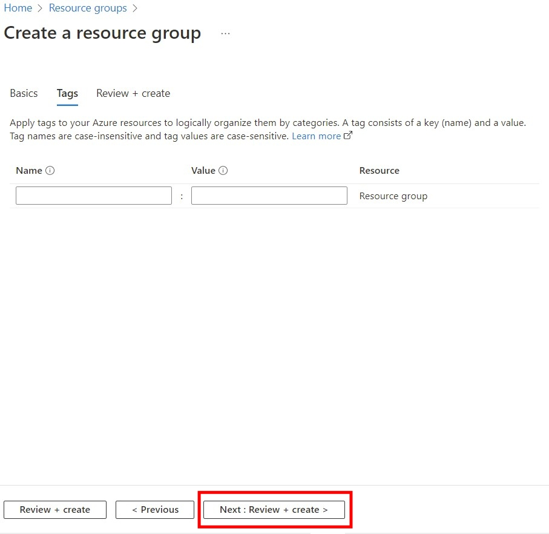
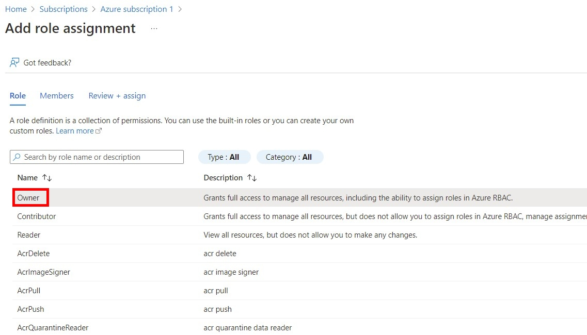
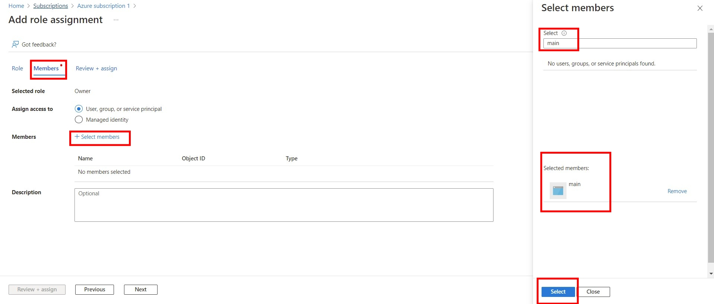

3.1 Логуємося до Azure Portal
 
<p style='color:red'><b>3.2 Наразі в Azure немає можливості створювати Linux сервери в free tier підписці: </b></p>


Детальніше по цьому:
https://www.theregister.com/2020/03/29/microsoft_azure_usage_surge_coronavirus/

https://stackoverflow.com/questions/60902189/how-do-i-create-a-virtual-machine-on-azure-when-there-are-no-sizes-available-for

Якщо щось зміниться пишіть, будемо фіксати.

<b>Тому потрібно переходити на Pay as go Subscription, але майте на увазі що він платний, але є можливість використовувати сервери типу Bs1 в яких є 750 годин на місяц на один сервер безкоштовних! Тобто ми переходемо з Free Tier підписки на підписку Pay as go Subscription, але все ще можемо використовувати сервери безкоштовно. Але тут уже не забуваємо слідкувати за використаними ресурсами.</b>

Щоб перейти на Pay as Go, виберіть свій Subscription, нажміть Upgrade, виберіть Basic Support Plan, і потім Upgrade:


---


3.3 Створюємо нову Resource Group - main

1.


---
2.


---
3.


---
4.


---
5.


---
6.


---

3.4 Створюємо Service Principal

3.4.1 Створюємо  Application в Azure Active Directory

Перейдіть до [Azure Active Directory](https://portal.azure.com/#blade/Microsoft_AAD_IAM/ActiveDirectoryMenuBlade/Overview)

Нажміть Add - App registration, заповніть так само як на скриншоті:


---


---

Перейдіть до створеного Application:
- скопіюйте значення Application (client) ID  - це буде  <b>client_id</b> в providers.tf
- скопіюйте значення Directory (tenant) ID - це буде <b>tenant_id </b> в providers.tf


---


---

3.4.2 Далі створюємо Client Secret, який буде використовуватися для автентифікації в тераформі.

Виберіть створений main Application, перейдіть до Certificate & secrets, нажміть New Client Secret: 


---


---

В меню знаходимо створений секрет, зберігаємо його Value - це буде <b>client_secret</b> в providers.tf


---

3.4.3 Далі надамо необхідні доступи до Azure ресурів створеному Application.

Для цього необхідно перейти в наш сабскріпшен, наприклад, за таким посиланням:
[Subscription](https://portal.azure.com/#blade/Microsoft_Azure_Billing/SubscriptionsBlade)

вибрати <b>Access Control (IAM) - Add role assignment</b>:


---

вибираємо роль <b>Owner</b> зі списку



---

вибираємо Members - user,group, or service principle + Select members і добавляємо наш обліковий запис, нажимаємо Select:



---

нажимаємо Next, в Review & assign нажимаємо Review & assign.


3.5 Відредагуємо `terraform/azure/providers.tf`, де вказуємо скопійовані раніше значення для: 
- subscription_id - його значення можна знайти за посиланням: [Subscription](https://portal.azure.com/#blade/Microsoft_Azure_Billing/SubscriptionsBlade)
- client_id 
- tenant_id 
- client_secret
```
provider "azurerm" {
  features {}
  subscription_id = "00000000-0000-0000-0000-000000000000"
  client_id       = "00000000-0000-0000-0000-000000000000"
  tenant_id       = "00000000-0000-0000-0000-000000000000"
  client_secret   = "CHANGE_ME"
}

```
