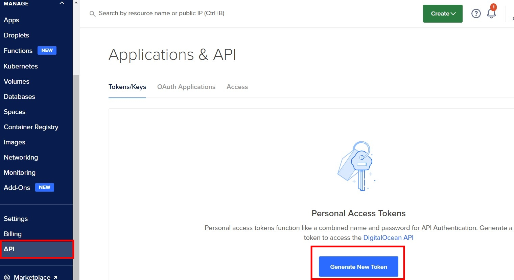
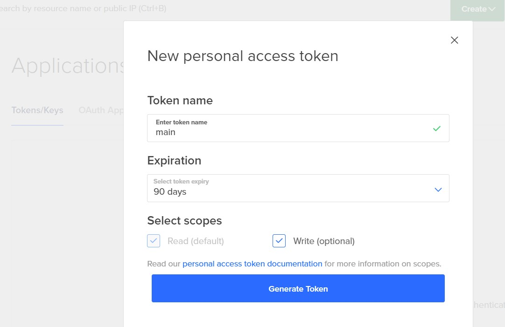
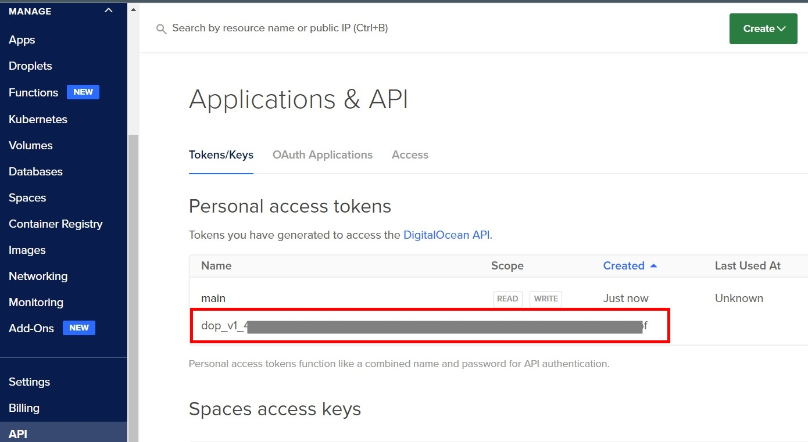

3.1 Логуємося до Digital Ocean:
- переходимо в меню API, генеруємо новий токін і копіюємо його

1.


---
2.


---
3.



3.2 Відредагуємо `terraform/do/providers.tf`, де вказуємо скопійований Token замість <i>CHANGE_ME</i>:

```
provider "digitalocean" {
  token = "CHANGE_ME"
}
```
