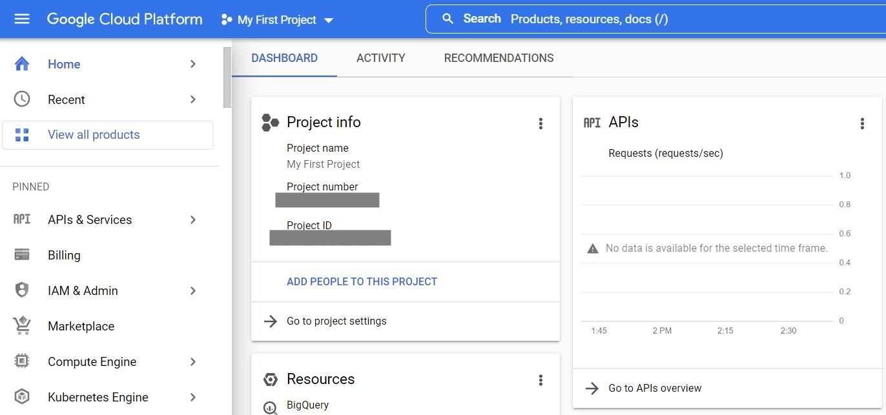
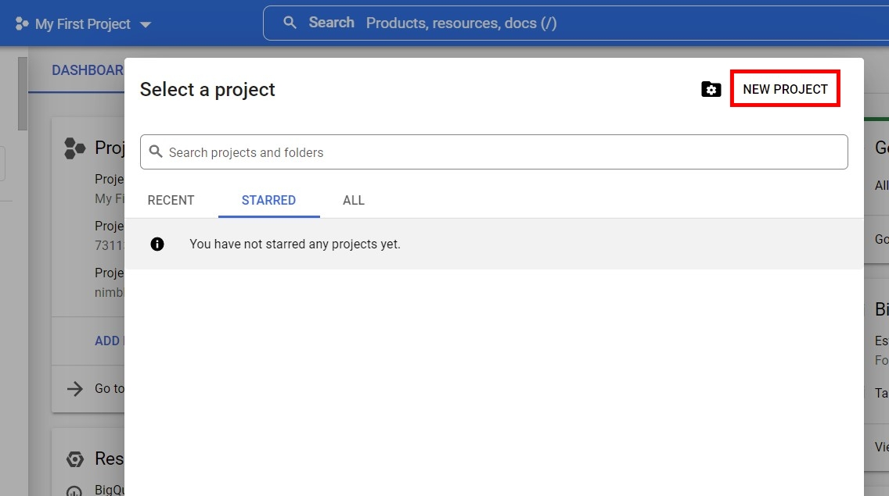
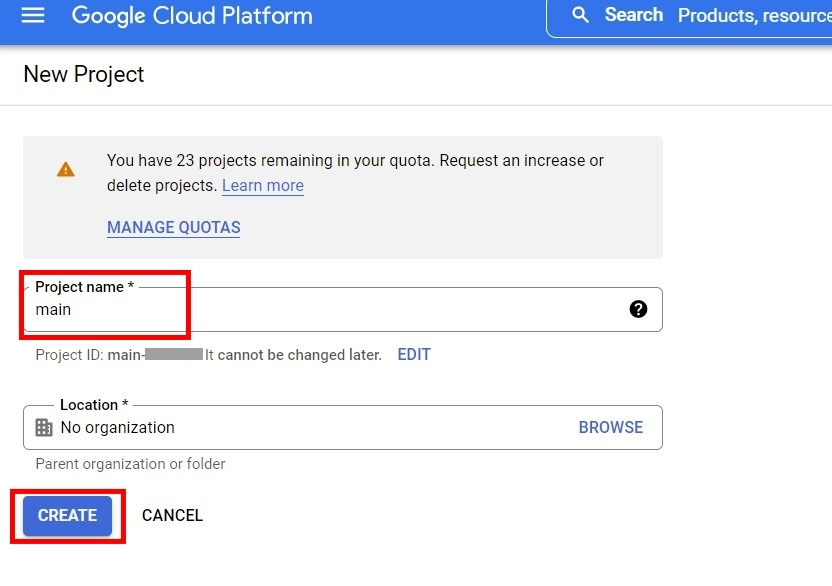
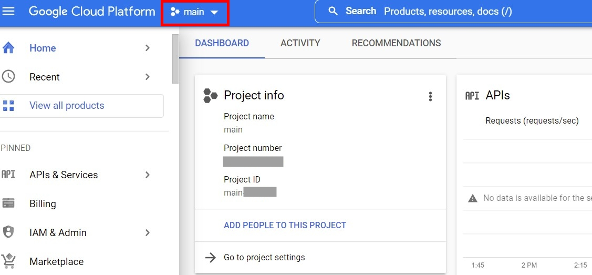
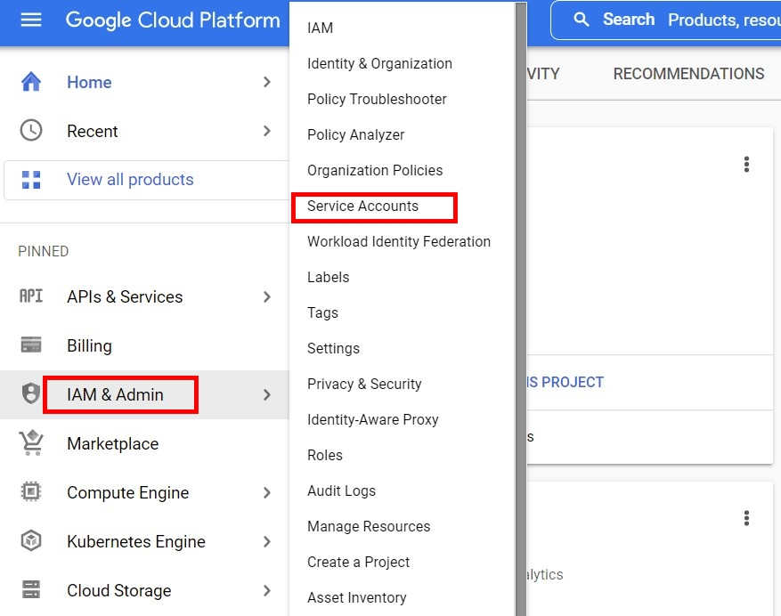
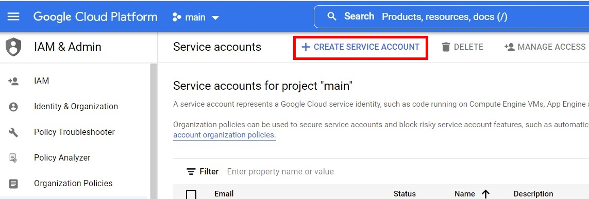
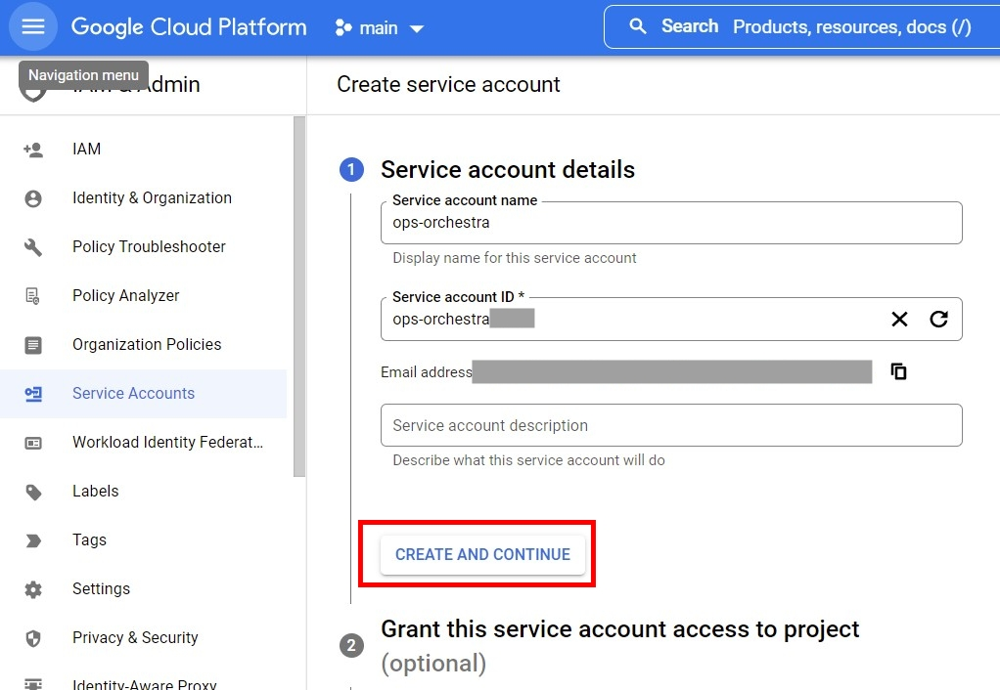
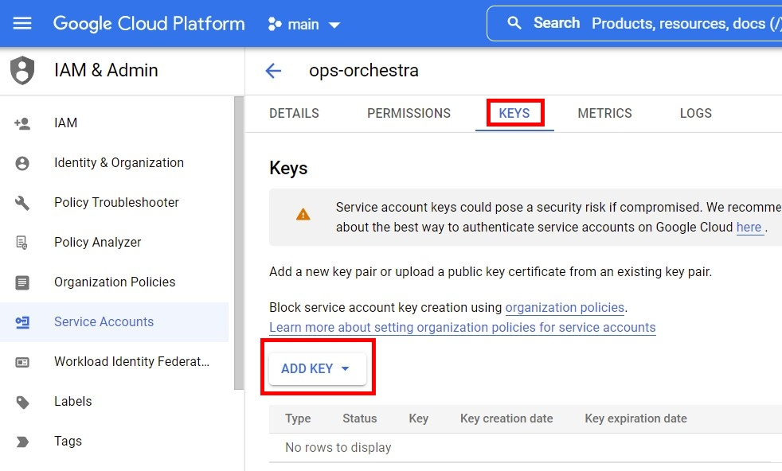
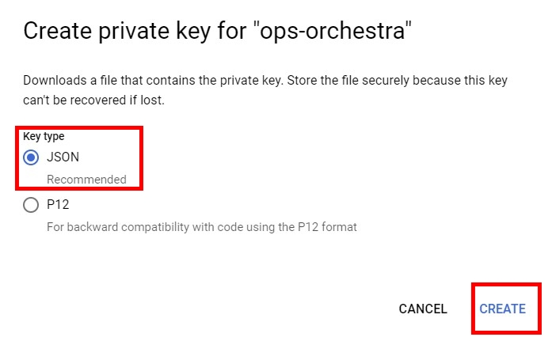
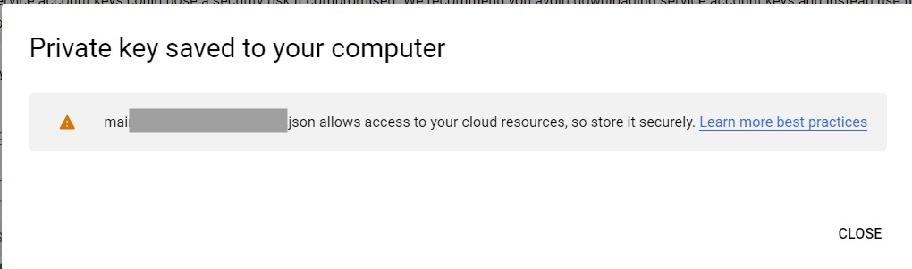

3.1 Логуємося в Google Cloud Platform:
- створюємо новий Project за назвою 'main' 
- в ньому створюємо Service Account з JSON ключем
:
1.


---
2.


---
3.


---
4.


---
5.


---
6.


---
7.


---
8.


---
9.


---
10.


---

3.2 Зберігаємо створений ключ і кладемо його в папку `terraform/gcp/` під назвою main.json

3.3 Відредагуємо `terraform/gcp/providers.tf`, де вказуємо project id замість "-XXXX":

```
provider "google" {
  project = "main-XXXX"
  region  = local.region
  zone    = local.zone
  credentials = "${file("main.json")}"
}
```
